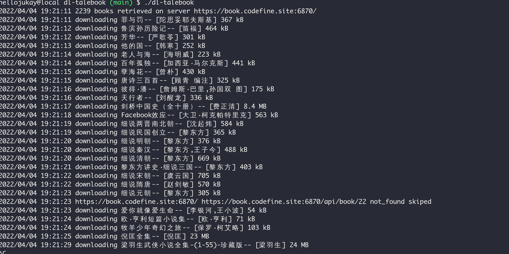

# dl-talebook
Downloading books from [talebook server](https://github.com/talebook/talebook) 。

# Demo

# Install
```
go install github.com/hellojukay/dl-talebook@latest
```
# Help
```
hellojukay@local dl-talebook (main) $ ./dl-talebook -h
Usage of ./dl-talebook:
  -dir string
        data dir (default "./")
  -password string
        password
  -site string
        tabebook web site (default "https://book.codefine.site:6870/")
  -timeout duration
        http timeout (default 10s)
  -user-agent string
        http userAgent (default "Mozilla/5.0 (X11; Linux x86_64) AppleWebKit/537.36 (KHTML, like Gecko) Chrome/99.0.4844.51 Safari/537.36")
  -username string
        username
```
